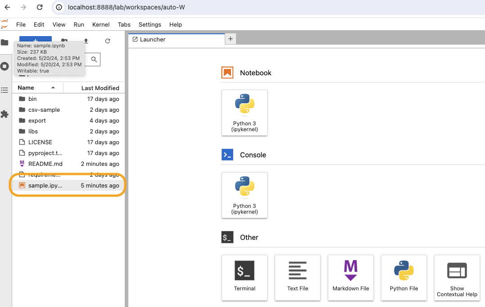

# Lab Bank CSVエクスポートデータ活用サンプル

本リポジトリは[Lab Bank](https://labbank.jp/)で出力されたCSVエクスポートデータを活用するための、サンプルコードを格納しております。

```
.
├── README.md ... 本ドキュメント
├── export ... サンプルコード向けのダミーのエクスポートデータ
├── libs ... pandasを簡単に扱うための関数
└── sample.ipynb ... サンプルコード
```

## 使い方

### 動作環境

- [virtualenv@20.26.2](https://virtualenv.pypa.io/en/latest/installation.html)


```sh
# virtualenvを有効化
$ python3 -m virtualenv -p 3.11.6 csv-sample
$ source csv-sample/bin/activate

# 必要なライブラリのインストール
$ pip install -r requirements.txt

# Jupyter Labを起動
$ jupyter lab --NotebookApp.token='' --NotebookApp.password=''
```

[http://localhost:8888/lab](http://localhost:8888/lab)にアクセスし、sample.ipynbを実行してください。


```sh
# virtualenvを終了
$ source csv-sample/bin/deactivate
```
